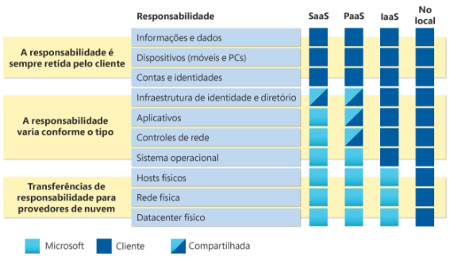

**Microsoft Azure**
# **Computação em nuvem**
**Desafio de Projeto 1**

- O que é computação em nuvem?
  - A **computação em nuvem** é a prestação de serviços de computação através da Internet, os serviços em nuvem também expandem as ofertas tradicionais de TI para incluir coisas como Internet das Coisas (IoT), aprendizado de máquina (ML) e inteligência artificial (IA). habilitando inovações mais rápidas, recursos flexíveis e economia, pois não precisa depender de infraestrutura física.
- Responsabilidade compartilhada.
  - **Provedor de nuvem**: Responsável pela segurança física, energia, resfriamento e conectividade de rede.
  - **Consumidor**:  É responsável pelos dados e informações armazenados na nuvem. Se for implantada uma máquina virtual e foi instalado um banco de dados SQL nela, será responsável por Atualizações e/ou correções no software e atualizações de banco de dados.
- Modelos de nuvem
  - Público.
    - Pertencente a serviços de nuvem ou provedor de hosting.
    - Fornece recursos e serviços a várias organizações e usuários.
    - Acessada via conexão de rede segura (geralmente pela Internet).
  - Privado.
    - As organizações criam um ambiente em nuvem em seu datacenter.
    - As organizações são responsáveis por operar 
      os serviços que fornecem.
    - Não fornece acesso aos usuários fora da organização.
  - Híbrido.
    - Combina nuvens públicas e privadas para permitir que os aplicativos sejam executados no local mais adequado.
  - MultiCloud.
    - Combina nuvens públicas e privadas e trabalhando o uso de serviços da cloud de dois ou mais fornecedores, (como AWS, Microsoft Azure, etc). Teremos assim uma maior variedade de recursos e escalabilidade e menos dependência de um serviço ou de fornecedor.
- Custo de capital versus custo operacional
  - Modelo baseado no consumo.
    - Os usuários finais pagam somente pelos recursos que usam. Gerando:
      - Melhor previsão de custos.
      - Preços para recursos e serviços individuais.
      - A cobrança é feita com base no seu uso real.
  - Despesas de capital e operacionais.
    - Despesas de capital (CapEx)
      - O gasto inicial com infraestrutura física. Computadores, racks, servidores, cabeamento, servidores, ar condicionado, etc.
      - Tem um valor que diminui com o tempo
    - Despesas operacionais (OpEx)
      - Gastos com produtos e serviços necessários. Energia, manutenção, reposições, recursos em nuvens, etc.
      - O valor é cobrado de imediato

**Desafio de Projeto 2**

- Benefícios da nuvem.
  - Alta disponibilidade.
    - SLA – Garante o máximo possível de disponibilidade (99%, 99,99%, etc.) se não for cumprido, independentemente de quais interrupções ou eventos que possam ocorrer, vai ser dado uma compensação ou crédito de acordo com o contrato.
  - Escalabilidade.
    - E a capacidade de ajustar recursos para atender as demandas; tanto quando a demanda aumenta, como quando ela cai, o que reduziria os custos.
    - Escalabilidade Vertical – Aumento da capacidade de processamento, memória.
  - Elasticidade.
    - Se houver um aumento repentino na demanda, os recursos também sobem de acordo com a demanda. Podendo ser programado o aumento ou diminuição dos recursos de acordo com a demanda (de modo manual ou automático).
  - Confiabilidade.
    - Por ser descentralizado, em diversas regiões, tem mais garantia de confiabilidade, o que envolve a capacidade de recuperação rápida.
  - Previsibilidade.
    - A garantia de que podemos saber que em todo momento, poderemos confiar nos recursos, no desempenho e quais serão os custos.
  - Segurança.
    - Os serviços em nuvem oferecem ferramentas de segurança, mas cabe ao cliente implementar as regras que serão seguidas, incluindo gerenciamento dois sistemas operacionais, software, bem como as atualizações e manutenção destes.
  - Governança.
    - Regras e padrões que irão gerir empresa. Como por exemplo: patches serão aplicados automaticamente? Quais as regras de negócio?
    - As regras podem ser da empresa ou referente a prestação de contas com outros.
  - Gerenciabilidade.
    - Ampla disponibilidade de mecanismos para gerenciamento (como por CLI, Aplicativos, etc.). Podendo ter modelos prontos para agilizar e evitar erros.

**Desafio de Projeto 3**

- Tipos de Serviços em nuvem.
  - IaaS – Infraestrutura como Serviço.
    - Maior controle, maiores possibilidades visto que configura e gerencia o hardware.
    - Exemplos: Servidores e armazenamento, Firewalls/segurança de rede, Planta física do datacenter. – Tudo na nuvem.
  - PaaS – Plataforma como Serviço.
    - Menor controle, visto que o gerenciamento da plataforma é feito pelo provedor, mas exigirá menos esforços, e toda a atenção se concentrará no desenvolvimento de aplicativos.
    - Exemplos: Sistemas operacionais, ferramentas para desenvolvedores, banco de dados.
  - SaaS – Software como Serviço.
    - Menor controle de todos. Pagamento de acordo com o uso e a assinatura. O que vai determinar ao que o usuário tem acesso, é o plano escolhido.
    - Exemplos: Aplicativos e apps hospedados.
- Modelo de responsabilidade compartilhada.

